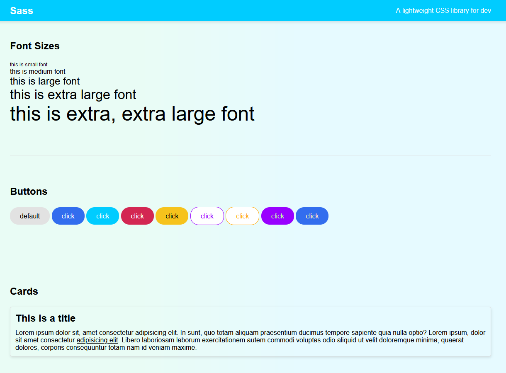

# Sass

The library with variables, colors, breakpoints, buttons, various utilities and more.

## Screenshots

Homepage

Index

See code <a href="https://github.com/veronikagregorec/sass/tree/main/sass">here</a>

[Back to the top](#sass)
